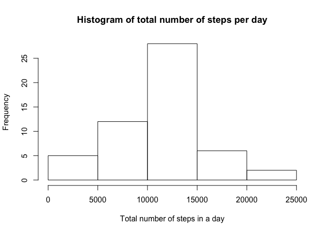
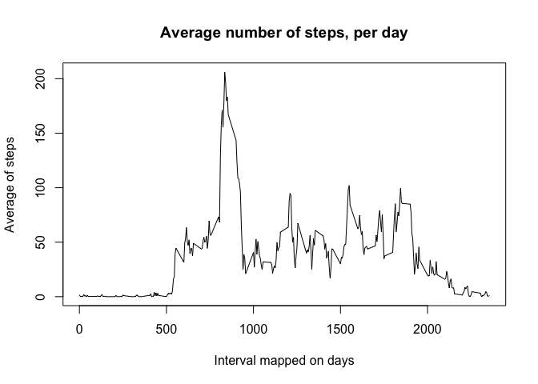
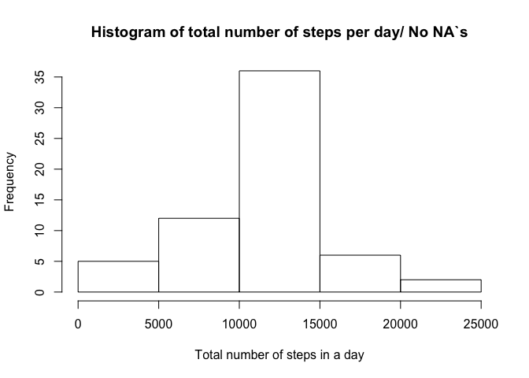
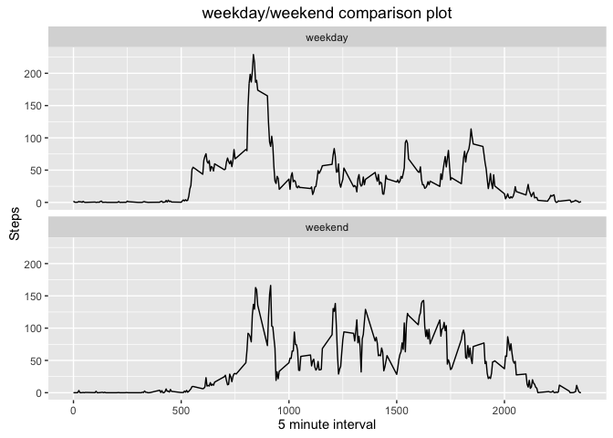

# Reproducible Research - Assignment 1
Dr. Markus Pleier  
29 Mai 2016  
##Description of the Assignment
###Introduction
It is now possible to collect a large amount of data about personal movement using activity monitoring devices such as a Fitbit, Nike Fuelband, or Jawbone Up. These type of devices are part of the “quantified self” movement – a group of enthusiasts who take measurements about themselves regularly to improve their health, to find patterns in their behavior, or because they are tech geeks. But these data remain under-utilized both because the raw data are hard to obtain and there is a lack of statistical methods and software for processing and interpreting the data.

This assignment makes use of data from a personal activity monitoring device. This device collects data at 5 minute intervals through out the day. The data consists of two months of data from an anonymous individual collected during the months of October and November, 2012 and include the number of steps taken in 5 minute intervals each day.

The data for this assignment can be downloaded from the course web site:

Dataset: Activity monitoring data [52K]
The variables included in this dataset are:

steps: Number of steps taking in a 5-minute interval (missing values are coded as 𝙽𝙰)
date: The date on which the measurement was taken in YYYY-MM-DD format
interval: Identifier for the 5-minute interval in which measurement was taken
The dataset is stored in a comma-separated-value (CSV) file and there are a total of 17,568 observations in this dataset.

### Results
####Repo

1. Valid GitHub URL
2. At least one commit beyond the original fork
3. Valid SHA-1
4. SHA-1 corresponds to a specific commit

####Commit containing full submission

1. Code for reading in the dataset and/or processing the data
2. Histogram of the total number of steps taken each day
3. Mean and median number of steps taken each day
4. Time series plot of the average number of steps taken
5. The 5-minute interval that, on average, contains the maximum number of steps
6. Code to describe and show a strategy for imputing missing data
7. Histogram of the total number of steps taken each day after missing values are imputed
8. Panel plot comparing the average number of steps taken per 5-minute interval across weekdays and weekends
9. All of the R code needed to reproduce the results (numbers, plots, etc.) in the report

###Assignment
This assignment will be described in multiple parts. You will need to write a report that answers the questions detailed below. Ultimately, you will need to complete the entire assignment in a **single R markdown** document that can be processed by knitr and be transformed into an HTML file.

Throughout your report make sure you always include the code that you used to generate the output you present. When writing code chunks in the R markdown document, always use 𝚎𝚌𝚑𝚘 = 𝚃𝚁𝚄𝙴 so that someone else will be able to read the code. This assignment will be evaluated via peer assessment so it is essential that your peer evaluators be able to review the code for your analysis.

For the plotting aspects of this assignment, feel free to use any plotting system in R (i.e., base, lattice, ggplot2)

Fork/clone the GitHub repository created for this assignment. You will submit this assignment by pushing your completed files into your forked repository on GitHub. The assignment submission will consist of the URL to your GitHub repository and the SHA-1 commit ID for your repository state.

NOTE: The GitHub repository also contains the dataset for the assignment so you do not have to download the data separately.

####Loading and preprocessing the data

Show any code that is needed to

1. Load the data (i.e. 𝚛𝚎𝚊𝚍.𝚌𝚜𝚟())

```r
setwd("/Users/MAP/CloudStation/Data Scientist/Reproducible Research/Assignment/Assigment 1")
data <- read.csv("../data/activity.csv",header=TRUE)
```
2. Process/transform the data (if necessary) into a format suitable for your analysis  

```r
print(str(data))
```

```
## 'data.frame':	17568 obs. of  3 variables:
##  $ steps   : int  NA NA NA NA NA NA NA NA NA NA ...
##  $ date    : Factor w/ 61 levels "2012-10-01","2012-10-02",..: 1 1 1 1 1 1 1 1 1 1 ...
##  $ interval: int  0 5 10 15 20 25 30 35 40 45 ...
## NULL
```
####What is mean total number of steps taken per day?

For this part of the assignment, you can ignore the missing values in the dataset.

1. Calculate the total number of steps taken per day

```r
dataSum <- aggregate(data$steps, by=list(date=data$date), FUN=sum)
names(dataSum) <- c("date","steps")
print(head(dataSum))
```

```
##         date steps
## 1 2012-10-01    NA
## 2 2012-10-02   126
## 3 2012-10-03 11352
## 4 2012-10-04 12116
## 5 2012-10-05 13294
## 6 2012-10-06 15420
```

2. If you do not understand the difference between a histogram and a barplot, research the difference between them. Make a histogram of the total number of steps taken each day

```r
hist(dataSum$steps,main="Histogram of total number of steps per day", 
     xlab="Total number of steps in a day")
```

<!-- -->

3. Calculate and report the mean and median of the total number of steps taken per day

```r
meanA <- mean(dataSum$steps,na.rm=TRUE)
medianA <- median(dataSum$steps,na.rm=TRUE)
```

The mean of steps taken per day is 1.0766189\times 10^{4} and the median is 10765

####What is the average daily activity pattern?

1. Make a time series plot (i.e. 𝚝𝚢𝚙𝚎 = "𝚕") of the 5-minute interval (x-axis) and the average number of steps taken, averaged across all days (y-axis)

```r
intervalSteps <- aggregate(steps ~ interval, data, mean)
plot(intervalSteps$interval,intervalSteps$steps,type="l",
     main ="Average number of steps, per day",
     ylab="Average of steps",xlab="Interval mapped on days")
```

<!-- -->

2. Which 5-minute interval, on average across all the days in the dataset, contains the maximum number of steps?

```r
print(intervalSteps[which.max(intervalSteps$steps),])
```

```
##     interval    steps
## 104      835 206.1698
```

####Imputing missing values

Note that there are a number of days/intervals where there are missing values (coded as 𝙽𝙰). The presence of missing days may introduce bias into some calculations or summaries of the data.

1. Calculate and report the total number of missing values in the dataset (i.e. the total number of rows with 𝙽𝙰s)

```r
missingRows <- length(data$date)-sum(complete.cases(data))
```

>*The missig row number is: 2304*

2. Devise a strategy for filling in all of the missing values in the dataset. The strategy does not need to be sophisticated. For example, you could use the mean/median for that day, or the mean for that 5-minute interval, etc.  

>*The strategy is that I will put in the mean of intervalls of the days, rounded to have full steps*  

3. Create a new dataset that is equal to the original dataset but with the missing data filled in.


```r
meanInterval <- aggregate(data$steps, by=list(interval=data$interval), FUN="mean",na.rm=TRUE)
data2 <- data
for (i in 1:length(data2$steps)) {
        if (is.na(data2$steps[i])) {
                data2$steps[i] <- round(meanInterval$x[(i %% length(meanInterval$x))+1])
        } else {
                data2$steps[i] <- data2$steps[i]
        }
}
```


4. Make a histogram of the total number of steps taken each day and Calculate and report the mean and median total number of steps taken per day. Do these values differ from the estimates from the first part of the assignment? What is the impact of imputing missing data on the estimates of the total daily number of steps?


```r
dataSum2 <- aggregate(data2$steps, by=list(date=data2$date), FUN=sum)
names(dataSum2) <- c("date","steps")
hist(dataSum2$steps,main="Histogram of total number of steps per day/ No NA`s", 
     xlab="Total number of steps in a day")
```

<!-- -->

>Does the mean and median differ (yes)?


```r
meanB <- mean(dataSum2$steps)
medianB <- median(dataSum2$steps)
diffMean = meanA - meanB
diffMedian = medianA - medianB
```

>The new mean mean is 1.0765639\times 10^{4} and the new median is 1.0762\times 10^{4}. The difference is in mean 0.549335 and in median 3.  
> The impact is that the mean and median are going down, see above values for details

####Are there differences in activity patterns between weekdays and weekends?

For this part the 𝚠𝚎𝚎𝚔𝚍𝚊𝚢𝚜() function may be of some help here. Use the dataset with the filled-in missing values for this part.


1. Create a new factor variable in the dataset with two levels – “weekday” and “weekend” indicating whether a given date is a weekday or weekend day.


```r
weekend = c("Sonntag","Samstag") # German for Sunday and Saturday
data2$weekFactor <- ifelse(weekdays(as.Date(data2$date)) %in% weekend,"weekend","weekday")
data2$weekFactor <- factor(data2$weekFactor)
str(data2)
```

```
## 'data.frame':	17568 obs. of  4 variables:
##  $ steps     : num  0 0 0 0 2 1 1 0 1 0 ...
##  $ date      : Factor w/ 61 levels "2012-10-01","2012-10-02",..: 1 1 1 1 1 1 1 1 1 1 ...
##  $ interval  : int  0 5 10 15 20 25 30 35 40 45 ...
##  $ weekFactor: Factor w/ 2 levels "weekday","weekend": 1 1 1 1 1 1 1 1 1 1 ...
```

2. Make a panel plot containing a time series plot (i.e. 𝚝𝚢𝚙𝚎 = "𝚕") of the 5-minute interval (x-axis) and the average number of steps taken, averaged across all weekday days or weekend days (y-axis). See the README file in the GitHub repository to see an example of what this plot should look like using simulated data.


```r
library(ggplot2)
stepsAgg <- aggregate(steps ~ interval + weekFactor, data2, mean)
qplot(x=interval,y=steps,data=stepsAgg,geom="line",
      main = "weekday/weekend comparison plot",
      xlab = "5 minute interval",
      ylab = "Steps") + facet_wrap(~ weekFactor,ncol = 1)
```

<!-- -->


